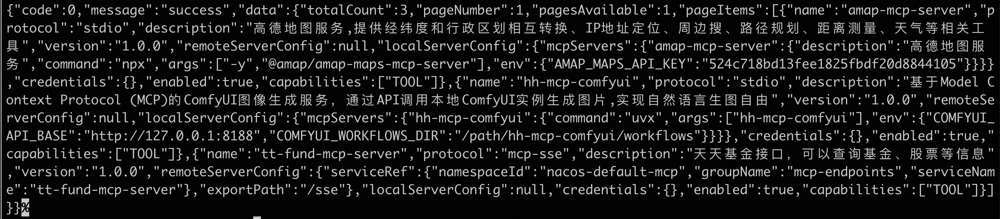

## 常见问题排查

### MCP搜索结果为空
1. 确认环境变量NACOS_ADDR、NACOS_USERNAME、NACOS_PASSWORD配置正确
2. 检查Nacos Server是否正常
```shell
curl -i "http://$NACOS_ADDR/nacos/v3/admin/ai/mcp/list?" -H "userName:$USERNAME" -H "password:$PASSWORD"
curl -i "http://$NACOS_ADDR/nacos/v3/admin/ai/mcp?mcpName=$MCP_NAME" -H "userName:$USERNAME" -H "password:$PASSWORD"
```
   正常应返回类似如下内容
   

3. 0.1.9之前版本限流问题
因Nacos服务端升级，nacos-mcp-router 0.1.9之前的版本使用3.0.1及之后的Nacos服务端时可能会因为限流导致搜素结果为空，请升级nacos-mcp-router版本至0.1.9以上

### 启动失败问题
1. 请确认uvx或npx等命令已安装且相应账号有执行权限。如果命令确认安装，可以尝试把mcp配置中command字段的值改为绝对路径
2. 确认网络正常，nacos-mcp-router启动过程中需要下载依赖

